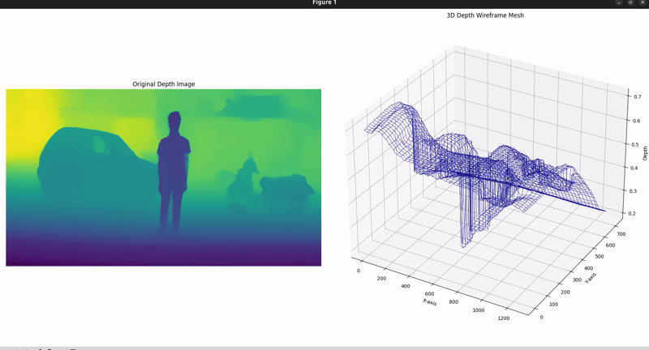

# Simple code to build 3D depth map

This repository contains Python code to visualize depth images in the form of 3D wireframe meshes. The code uses OpenCV to read depth images and Matplotlib for 3D plotting, allowing users to create detailed depth visualizations with minimal effort.

<div align="center">
    <a href="https://github.com/bharath5673/3D-Depth-Wireframe-Mesh">
        
    </a>
    <p>
        3D Depth Wireframe Mesh Visualization.
    </p>
</div>

## Features:
- Load depth images and visualize them as 3D wireframe meshes.
- Optional downsampling to adjust visualization performance.
- Easy-to-use code for quick visualization of depth data.

## Use Cases
- **IMU + Camera Integration**: For integrating IMU and depth data for advanced robotics applications.
- **SLAM for Robotics**: Building 3D maps of environments to assist in localization and mapping tasks.
- **ADAS**: Developing simple 3D depth perception systems for collision avoidance and object detection in ADAS.
- **Mapping & Navigation**: Use depth maps to plan navigation paths for autonomous systems like drones or robots.


## Prerequisites:
The following libraries are required to run the code:
- Python 3.x
- OpenCV
- Matplotlib
- NumPy

To install these dependencies, you can use:
```bash
pip install opencv-python matplotlib numpy
```

## Customization
- Adjust the downsample_rate to control the quality vs. performance of the 3D wireframe plot.
- Modify the color and line width of the mesh in the "ax.plot_wireframe()" call.

____
This project demonstrates how to visualize depth data from an image as a 3D wireframe mesh using Python. The code leverages OpenCV to load and process the depth image, and Matplotlib to render the 3D wireframe. It's designed to help visualize depth maps or images from depth sensors (e.g., stereo cameras, LiDAR, or monocular depth estimation models) in an easy and intuitive way.
